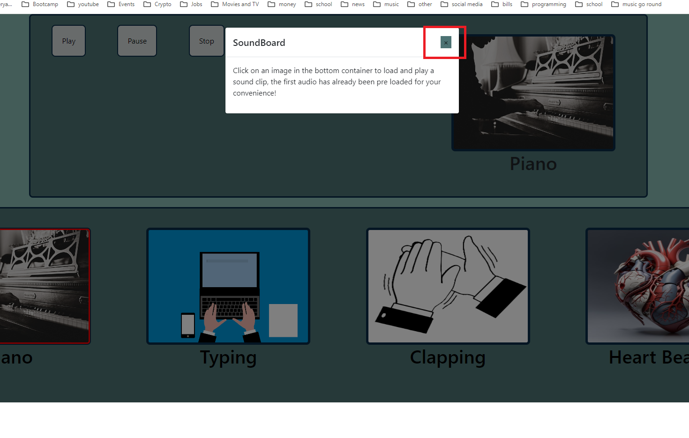
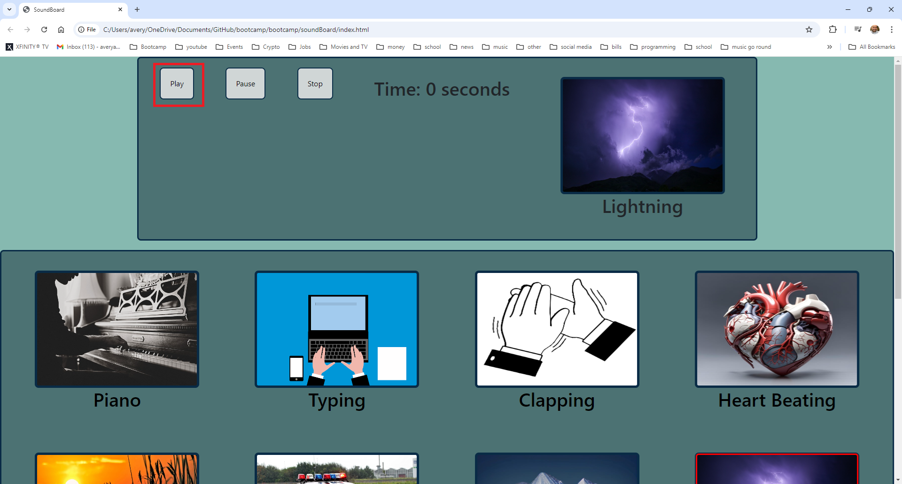
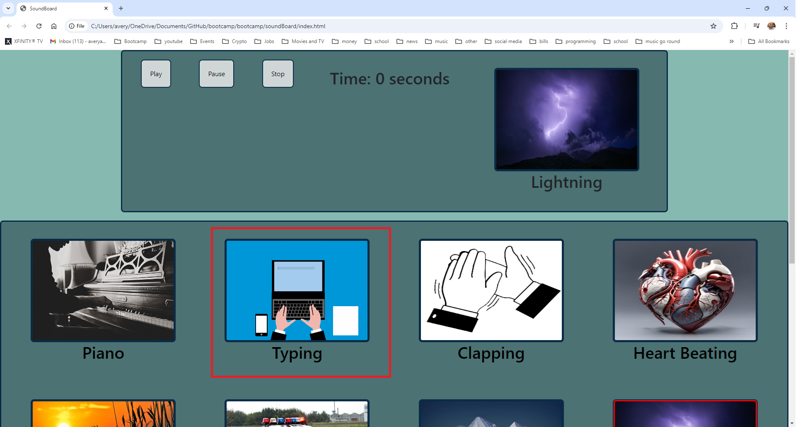

# <Sound Board>

## Description

- This project executes developer practices and habits in creating an application with accompanied relevant documentation. It is our motivation that we want to improve our skills as developers so that we can expand our professional abilies. In building this project we can learn best practices and optimize our skills as a professional while understanding new 
developer tools such as html, css, javascript and github. With this project we created a web page that has a set of audio files with associated images that are able to play when the user clicks on one of the images with one audio file and image pre loaded. There is a modal that describes what the pages does when you first go to the site or you can click the about butten to see the explaintion of the page again. 

- In doing this project we have learned how to think like a developer and practice developer habits by learning how to set up a web development project and how to track our changes and development in a version tracking tool. We followed a process of creating and closing issues in github and creating documentation for my application. There were a number of tech stacks that were used in this project such as html-HTML, CSS and Javascript. Github was used for the version control tool which has all the branch repositories, open and closed issues, and logs to saved changes. It also includes a professional readme, showing installation of my app, how to use it, license, features, how to contribute and how to test the application.  

- Throught this project we have learned professional practices and habits, new technologies and how to deploy my app and made app live on the internet for everyone to see and contribute to.  

-  This project is a media player that we built to reinforce our knowledge of git, HTML, CSS, and Java Script. It is reactive to different screen sizes and to user input. This project allows users to play commonly used sound effects. 

## link to soundboard

https://thereal4m4d3u5.github.io/soundBoard/

## Table of Contents 

- 
  - [Description](#description)
  - [link to soundboard](#link-to-soundboard)
  - [Table of Contents](#table-of-contents)
  - [Installation](#installation)
  - [Usage](#usage)
  - [Credits](#credits)
  - [License](#license)
  - [Features](#features)
  - [How to Contribute](#how-to-contribute)
  - [Tests](#tests)
  - [About-Us](#about-us)

## Installation

N/A

## Usage

Click on the index file to open 

Close modal

Stop audio file

Pause audio file

Play audio file

Select a new audio file 

## Credits

University of Minnesota

https://bootcampspot.instructure.com/

Authors : Devan Ballantine and Avery Jacobson

## License

MIT License

Copyright (c) [2024] [Avery Jacobson & Devan Ballantine]

Permission is hereby granted, free of charge, to any person obtaining a copy
of this software and associated documentation files (the "Software"), to deal
in the Software without restriction, including without limitation the rights
to use, copy, modify, merge, publish, distribute, sublicense, and/or sell
copies of the Software, and to permit persons to whom the Software is
furnished to do so, subject to the following conditions:

The above copyright notice and this permission notice shall be included in all
copies or substantial portions of the Software.

THE SOFTWARE IS PROVIDED "AS IS", WITHOUT WARRANTY OF ANY KIND, EXPRESS OR
IMPLIED, INCLUDING BUT NOT LIMITED TO THE WARRANTIES OF MERCHANTABILITY,
FITNESS FOR A PARTICULAR PURPOSE AND NONINFRINGEMENT. IN NO EVENT SHALL THE
AUTHORS OR COPYRIGHT HOLDERS BE LIABLE FOR ANY CLAIM, DAMAGES OR OTHER
LIABILITY, WHETHER IN AN ACTION OF CONTRACT, TORT OR OTHERWISE, ARISING FROM,
OUT OF OR IN CONNECTION WITH THE SOFTWARE OR THE USE OR OTHER DEALINGS IN THE
SOFTWARE.

## Features

html
CSS
JavaScript
developer tools

## How to Contribute

N/A

## Tests

Given a user has launched the url
When the user lands on the webpage
Then a pop-up modal should be shown with following text:
"Click on an image in the bottom container to load and play a sound clip, the first audio has already been pre loaded for your convenience!"

Given a user has launched the url
When the user lands on the webpage
And a pop-up modal is shown 
Then user should be able to click the close button and the modal should close

Given a user has launched the url 
And has their local storeage cleared
When the user lands on the webpage
And a pop-up modal is shown 
Then user should be able to click outside the modal and the modal should close

Given a user has launched the url 
And user has already been to the site at least once without clearing local storeage
When the user lands on the webpage
Then a pop-up modal is not shown

Given a user has launched the url 
When the user lands on the webpage
Then a webpage is shown with teal background behind a container 

Given a user has launched the url 
When the user lands on the webpage
And clicks the About button
Then a pop-up modal should be shown with following text:
"Click on an image in the bottom container to load and play a sound clip, the first audio has already been pre loaded for your convenience!"

Given a user has launched the url 
When the user lands on the webpage
Then a webpage is shown with a container on the top of the page
And has a blue background
And has a play button
And has a pause button
And has a stop button
And has Time displayed set to 0 seconds
And has the firt card loaded as an image

Given a user has launched the url 
When the user lands on the webpage
Then a webpage is shown with a container below the first container
And contains 12 images with a blue background

Given a user has launched the url 
When the user lands on the webpage
Then the play button should play the default first audio card
And the Time should start counting

Given a user has launched the url 
When the user lands on the webpage
Then the pause button should be able to pause the audio 
And the play button should resume the audio

Given a user has launched the url 
When the user lands on the webpage
Then the stop button should be able to stop the audio 
And the play button start the audio from the begining 

Given a user has launched the url 
When the user lands on the webpage
Then the user should be able to click on all 12 cards 
And the audio plays when button is pressed
And card get highlighted when button is pressed 
And image is shown in the main image

Given a user has launched the url is a mobile browser
When the user lands on the webpage
Then the UI should be able to be dynamic, flexable, and reactive without defects 

Given a user has launched the url is a mobile browser
When the user lands on the webpage
And tries to move the screen left, right or scale with thier fingers
Then the UI should not break and go back to original 

## About-Us

Avery Jacobson

I am an accomplished software engineer. I grew up in Edina and graduated from Edina High School. I have three associate degree, two computer science and an electrical engineering degree. I have been working as a software engineer for the last ten years as a software development engineer in test (sdet). I have worked on embedded systems, medical devices, criticail fight control systems, 3D printers and brokerage applications. I also play guitar, piano and trumpet and have been playing instruments for over 30 years. I have a whoodle named Wolfgang 🐶. 

Devan Ballantine

Hello this is Devan. At the time of writing this I'm currently a student at the University of Minnesota. I made this with my amazing partner Avery Jacobson. I knew how git worked before starting this project but this project really helped me understand both its importance and how the aproval to merge process works. I gained knowledge in how to play and manipulate audio objects in Java Script and am excited to see where my next project takes me.

Thanks for reading our ReadMe

